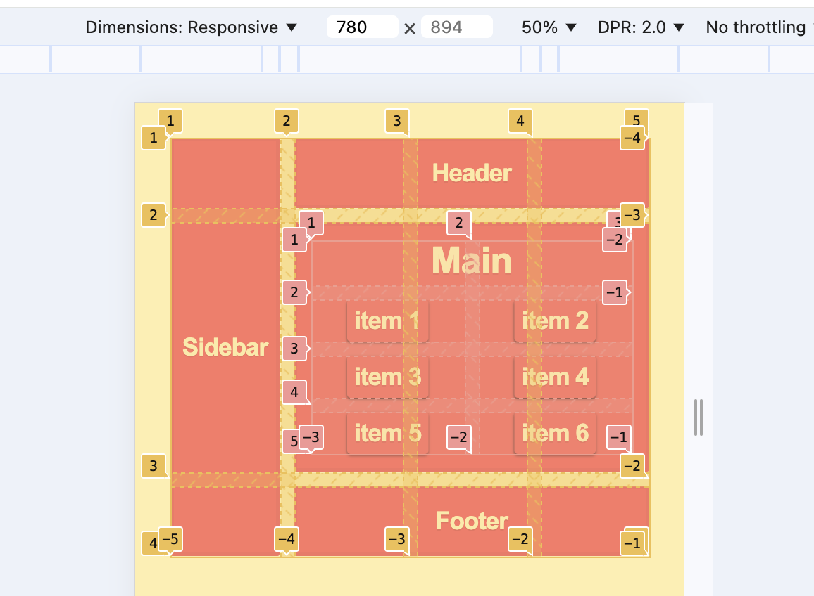

# Key Features:

## Grid Layout:

Created a grid with a header, main content, sidebar, and footer.

## Nested Grid:

Organized elements inside the main section using a nested grid.

## Responsive Design:

Used grid-template-areas and media queries to adjust the layout for mobile screens.

## Flexible Columns:

Utilized fr, minmax(), and auto-fit for adaptable and proportional column sizing.

# **Skills Practiced:**

- Grid structure and nesting.
- Dynamic and responsive layouts.
- Spacing and alignment with gap and align-items.

